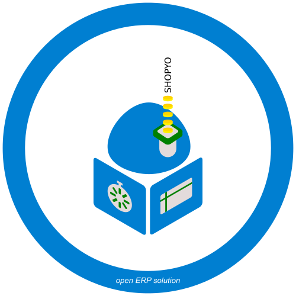
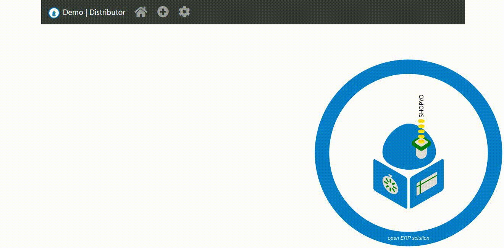

# Shopyo
:gift: Open inventory management  and Point of sales (powered by python) for small shops. 

- :ok_hand: Crisp UI
- :heartpulse: Intuitive
- :sparkler: Instant lookup
- :pencil2: Towards customisation

#



# Contributing countries

🇲🇺🇩🇪

# Just added features

- Confirmation before deleting section
- Settings fully operationable
- Apply settings works for existing and non-existing db

# History

Months ago i was searching github, looking for a point of sales solution using Python. What pricked me was that a good many had an annoying point. Some mandatorily required Posgres as though it ships with your computer, others' codebases were a tkinter spaghetti mess, yet others were django-based accounting monsters ...

I decided to give it a try, modelling it after a client request i once got. Made it flask-based with sqlalchemy+sqlite. You can instantly get started with no hassle, switching to something powerful when you want to (since it uses an ORM)

For the UI, we used the latest, bootstrap4, fa5 and jq3. Interestingly enough, i had two shop owners try it, the usage simplicity was praised

It's still in dev and supports instant lookup. Long story short, with some programming skills, you can solve some everyday problems. And yes, no cdn, all libs are bundled so that you can use it completely offline

you can still see the linked-in post [here](https://www.linkedin.com/feed/update/urn:li:activity:6551367967978979328).

# Community: Discord
[https://discord.gg/k37Ef6w](https://discord.gg/k37Ef6w)

# Install instructions

- download python3.7
- clone and cd into project
- run ```python -m pip install -r requirements.txt```

# Run instructions
run initialise.py

```python
python initialise.py
```

```python
python apply_settings.py
```

then run the app in shopyo/shopyo

```python
python app.py
```

the go to the indicated url

## In Action



